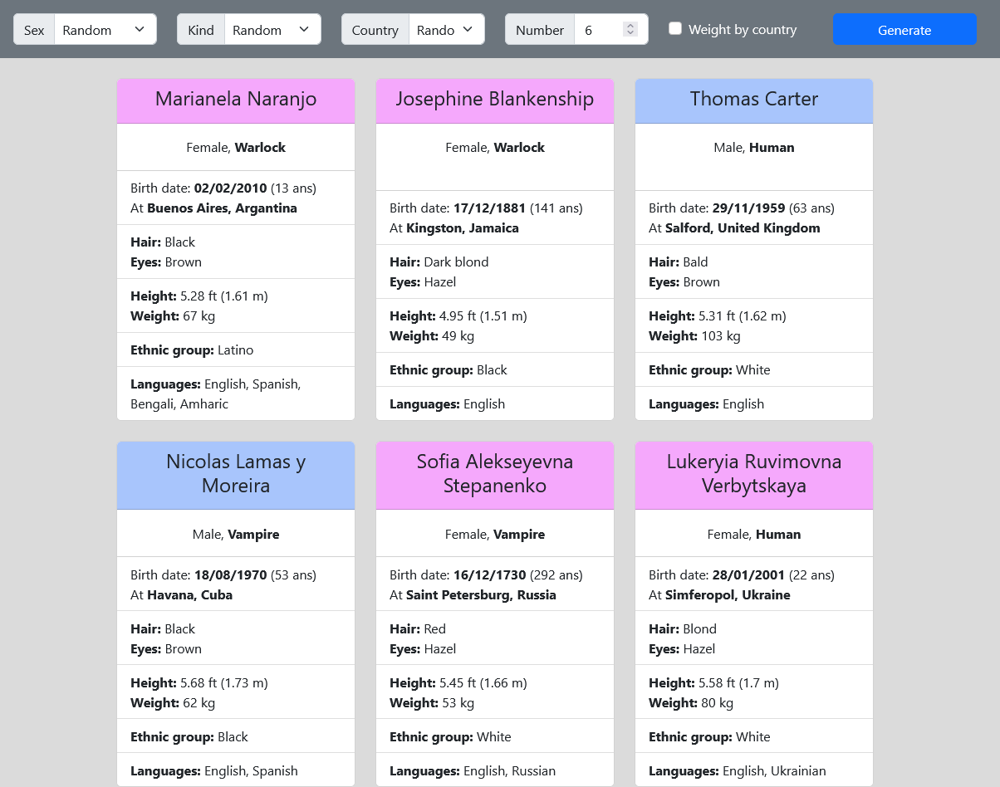

# RPG-USPersonGen

Random generator of people living in the US.

If everything is set to random, demographic and ethnic statistics are used to weight the random generation process, and create people as realistic as possible with accurate probabilities.

Simply download the folder and launch generator.html in your web browser.
